### Experiments

1)
Reverting back and following a simpler NN model as suggested in this article.

https://pemami4911.github.io/blog/2016/08/21/ddpg-rl.html

Actor
```
_________________________________________________________________
Layer (type)                 Output Shape              Param #   
=================================================================
states (InputLayer)          (None, 54)                0         
_________________________________________________________________
dense_359 (Dense)            (None, 32)                1760      
_________________________________________________________________
batch_normalization_16 (Batc (None, 32)                128       
_________________________________________________________________
activation_64 (Activation)   (None, 32)                0         
_________________________________________________________________
raw_actions (Dense)          (None, 2)                 66        
_________________________________________________________________
actions (Lambda)             (None, 2)                 0         
=================================================================
Total params: 1,954
Trainable params: 1,890
Non-trainable params: 64
```
Critic
```
__________________________________________________________________________________________________
Layer (type)                    Output Shape         Param #     Connected to                     
==================================================================================================
states (InputLayer)             (None, 54)           0                                            
__________________________________________________________________________________________________
dense_362 (Dense)               (None, 32)           1760        states[0][0]                     
__________________________________________________________________________________________________
batch_normalization_19 (BatchNo (None, 32)           128         dense_362[0][0]                  
__________________________________________________________________________________________________
actions (InputLayer)            (None, 2)            0                                            
__________________________________________________________________________________________________
activation_67 (Activation)      (None, 32)           0           batch_normalization_19[0][0]     
__________________________________________________________________________________________________
dense_363 (Dense)               (None, 32)           96          actions[0][0]                    
__________________________________________________________________________________________________
add_53 (Add)                    (None, 32)           0           activation_67[0][0]              
                                                                 dense_363[0][0]                  
__________________________________________________________________________________________________
activation_68 (Activation)      (None, 32)           0           add_53[0][0]                     
__________________________________________________________________________________________________
q_values (Dense)                (None, 1)            33          activation_68[0][0]              
==================================================================================================
Total params: 2,017
Trainable params: 1,953
Non-trainable params: 64
```

Various reward functions 

1) Change reward
```
return 0.02 + np.tanh(self.sim.pose[2]) + np.tanh(self.sim.v[2])
```
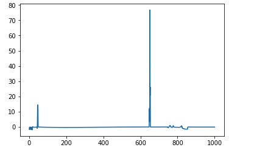
Didnt increase gradually

2) Change second layer size from 32 to 64 in actor
```
net = layers.Dense(units=64, activation='relu')(states)
```
Reward seems to go up.

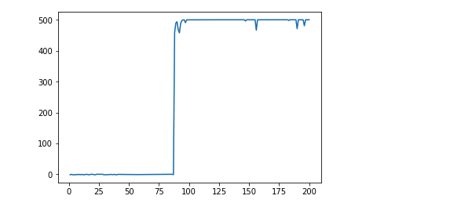

3) Change reward function back
```
return 0.02 + np.tanh(self.sim.pose[2]) - np.tanh(xy_distance)  + np.tanh(self.sim.v[2]) - np.tanh(distance_z)
```
Reward still seems to kinda work. 

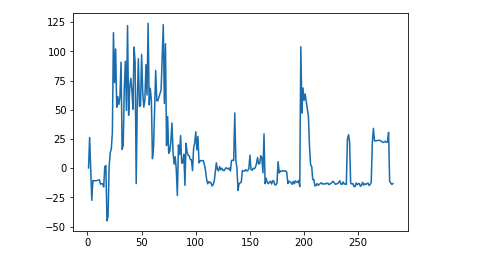

4) Adjusting discount factor and tau
```
self.gamma = 0.9  # discount factor
self.tau = 0.1  # for soft update of target parameters
```
Reward didn't go up at all.

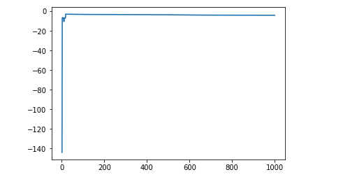

5) Adjusting discount factor and tau
```
self.gamma = 0.95  # discount factor
self.tau = 0.1  # for soft update of target parameters
```

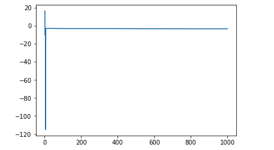

6) Adding batch normalization to critic `actions`
```
net_actions = layers.BatchNormalization()(net_actions)
net_actions = layers.Activation('relu')(net_actions)        
```        
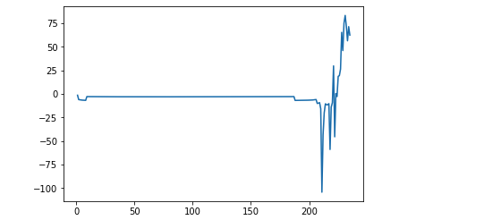
Seems promising

7) Changing reward function further
```
return 0.02 - np.tanh(xy_distance)  + np.tanh(self.sim.v[2]) - np.tanh(distance_z)
```
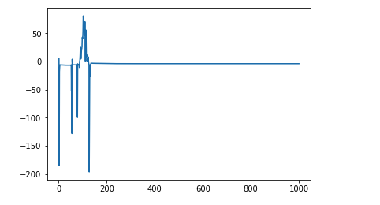
Removing extra weightage for z distance didnt let the drone fly. Interesting.

8) Multiple 2 to velocity reward
```
return 0.02 - np.tanh(xy_distance)  + 2 * np.tanh(self.sim.v[2]) - np.tanh(distance_z)
```
Drone seems to take off. Most likely reward function is still off as reward is still not increasing.

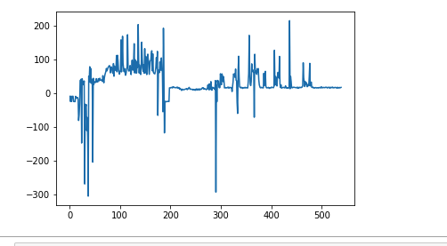 
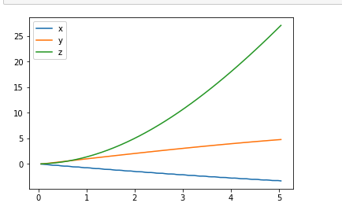

Z is raising, X and Z are controlled, which is great. Only problem is drone is going too far.


9) Control xy velocity and distance.


```
xy_velocity = abs(self.sim.v[:2]).sum()
return 0.02 - np.tanh(xy_distance) - np.tanh(xy_velocity) + 1.5 * np.tanh(self.sim.v[2]) - np.tanh(distance_z)

```
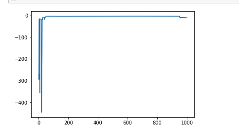

This ended up too negative.


10) Just control xy velocity

```
xy_velocity = abs(self.sim.v[:2]).sum()
return 0.02 - np.tanh(xy_distance) - np.tanh(xy_velocity) + 2 * np.tanh(self.sim.v[2]) - np.tanh(distance_z)

```
Z Position seems to go up but reward doesn't go up. Frustating!

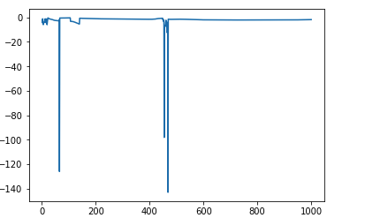
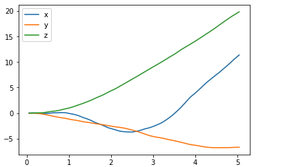


11) Reward goes to momentum instead
```
distance_x = (self.target_pos[0] - self.sim.pose[0])
distance_y = (self.target_pos[1] - self.sim.pose[1])
distance_z = (self.target_pos[2] - self.sim.pose[2])  
return 0.5 + np.tanh(distance_x * self.sim.v[0]) + np.tanh(distance_y * self.sim.v[1]) + np.tanh(distance_z * self.sim.v[2])
```

Reward and position are both wrong.


12) Going simple. Reward inverse of distance and a constant for keeping the episode running till the end.

```
reward = 0.001 + min(1, 1/(abs(distance) + 1))
```